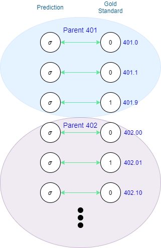
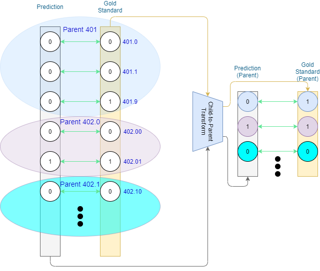
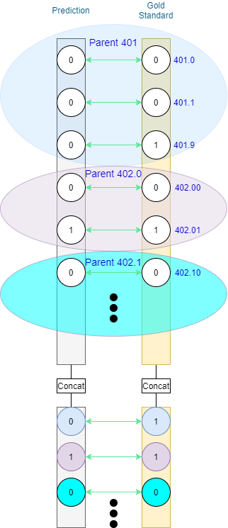
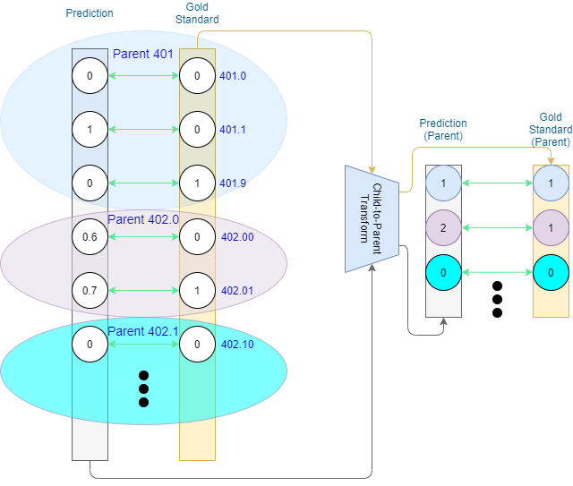
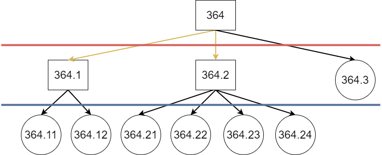

# icd9_hierachical_eval

## Requirements

``numpy``
``scipy.sparse.csr_matrix``

## Motivation
Evaluation in Large-Scale Multi-Label Classification, such as ICD-9 coding in MIMIC-III, is treated in prior art as exact-match evaluation. As these tasks are weakly labelled, we are comparing document-level predictions with document-level gold standard labels. For each document a prediction binary vector is compared to a gold-standard binary vector. The label space consists of leaf nodes within the ICD-9 tree, treating both the prediction and the gold standard as flat. 

  
  

Figure 1: A standard flat output evaluation approach to ICD coding task. Two sample code families indicated.

  

This basic evaluation treats all mismatches as equal, not considering the ontology's tree structure. For instance, if the document is labelled with *410.01	Acute myocardial infarction of anterolateral wall, initial episode of care*, but the model does not predict this code correctly, it does not matter if a sibling code *410.02 Acute myocardial infarction of anterolateral wall, subsequent episode of care*, or a cousin *410.11 Acute myocardial infarction of other anterior wall, initial episode of care*, or a more distantly related code, e.g. *401.9 Unspecified essential hypertension*, are predicted instead. All of these mispredictions are treated equally.

There has previosly been some effort in incorporating the structural nature of the label space of ICD ontologies - https://gate.ac.uk/sale/lrec2008/bdm.pdf (henceforth referred to as Maynard et al.). This study concerns a different task - an information extraction task with strong labels. The ICD codes are assigned to specific tokens within the document (both in prediction and in the gold standard). This strong labelling allows for exact comparison on a case-by-case basis -- this is unfortunately not possible in the weakly-labelled scenario where if a label is mispredicted, we cannot state with certainty what was its equivalent gold standard label.

One of the approaches to creating a metric for the structured label space in Maynard et al. is tracing the distance between the closest common parent on the graph (tree) of the ontology and either of the prediction and the gold standard. While we are unable to reuse this exactly, lacking the knowledge of which mispredicted code relates to the gold standard (*Responses* and *Keys* as they are called in the paper), we are able to make use of the common ancestor. 

## Hierarchical Evaluation
One way to do so is to not only evaluate on the leaf-level prediction, but also the codes' ancestors as per the structured label space (ontology). We can convert leaf-level predicitons into ancestor predictions by means of adjacency matrices and compare those against their respective converted gold standard.

Figure 2: A conversion from leaf-level to parent for both the prediction vector and the gold standard label vector. A similar conversion can be done for at least one more (grandparent) level.

Once we have these we can then either have separate metrics for each level, or combine them.

Figure 3: A comparison between predicions and gold standard. Ancestor vectors are concatenated with leaf vectors.

## Non-binary Setting
The example presented above is neat in that at most one prediction is made for each of the shown code families on the leaf level. What about multiple predictions within the same family?

We have two options here:

**(1)** Stick to binary (True if value of node > 0, False otherwise). if at least 1 node within the family is positive, the family is considered positive. The advantage of this approach is that standard P/R/F1 can be applied for the evaluation;

**(2)** Extend to full count, in which case each family value is a sum of the family's leaves. Standard binary P/R/F1 does not work in this case, but we retain more information that can tell us of over-/underprediction for the parent codes. The calculation of TP, FP, FN for a pair of aggregated predictions and labels for a single family of codes would look as follows:

let *x* be the number of predicted codes within a certain code family *f* for a document *d*.
let *y* be the number of gold standard codes within a certain code family *f* for a document *d*.

*TP(d,f) = min(x,y)*

*FP(d,f) = max(x-y,0)*

*FN(d,f) = max(y-x,0)*

Figure 4: A comparison between predictions and gold standard showing the non-binary scenario. Two phenomena of the non-binary ancestor evaluation are on display: **(1)** While there is a mismatch on the leaf level in the *401* family (401.1 predicted versus 401.9 expected), translated into the direct ancestor level (*401*), both the prediction and the true label are *401* respectively - allowing for a match on this level. **(2)** For parent *402* there are two leaves predicted, while 1 expected. This puts us in the non-binary scenario, with TP = 1, FP = 1, FN = 0. As displayed in (1), on this ancestor level the match between the leaves does not matter, but rather how many times the ancestor is involved. In this case the ancestor (*401*) is overpredicted by 1.

## Leaf Depth Mismatch

ICD-9 leaves appear at different depths. This means that a parent of one leaf code can be the grandparent of another. For instance, code *364* has a parent relation to the leaf *364.3* and grandparent to leaf *364.11*. This poses an issue to aggregation and evaluation. If we perform hierarchical evaluation based on direct ancestry, we will see 364 both in first-order ancestry and second-order ancestry. An argument can be made for representing the hierarchy as layers (depths) and hence aggregate the predictions/true labels of the descendants of each code within the layer (top-down), rather than represent the hierarchy through relations of ancestry (bottom up).

Figure 5: Ancestor-relation based representation, versus layer-based representation. Ancestor-relation based representaion of the hierarchy (black edges represent a parent relation, yellow edges represents a parent of a parent relation). The red and blue lines divide up the hierarchy based on layers (depth)
